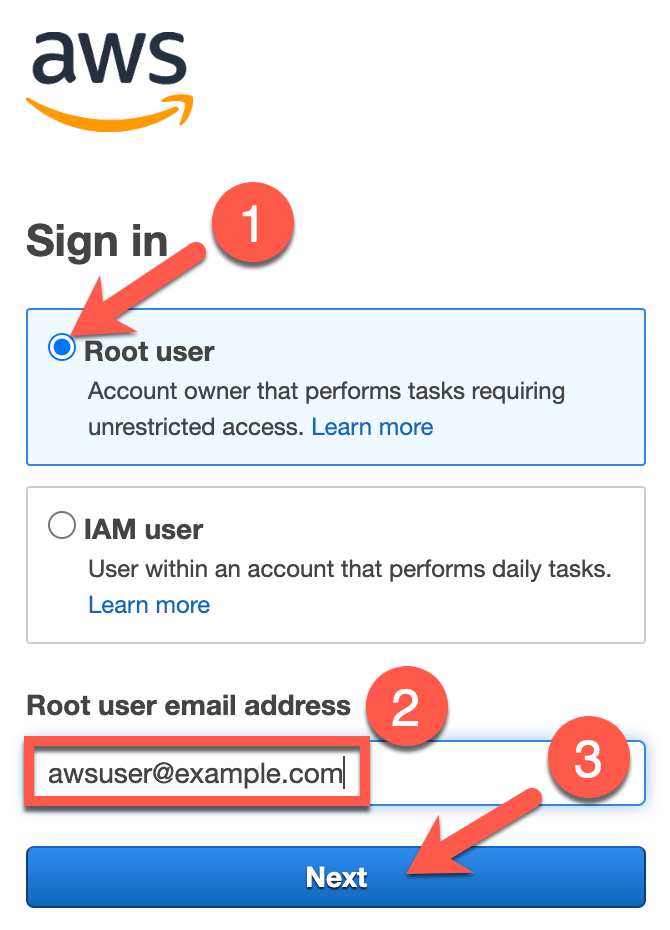
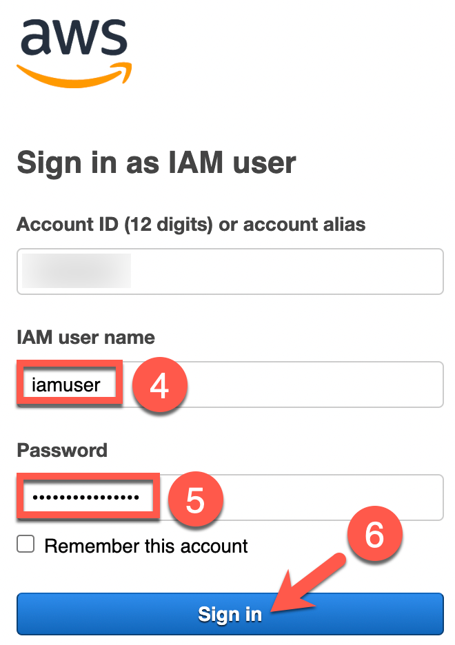
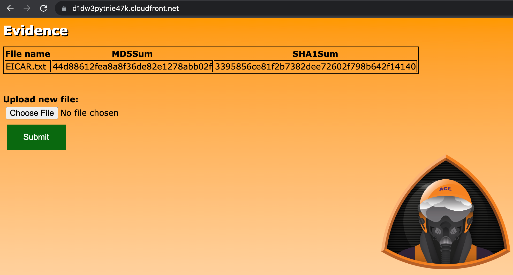

# Exercise 1: Deploying the Serverless Application

**Estimated time to complete:** 15 minutes

## Objectives

* Log into AWS account and launch **CloudShell** session in the N. Virginia (**us-east-1**) region.
* Download source code using `git` from developer's [GitHub repository](https://github.com/bluemountaincyber/evidence-app).
* Install Infrastructure as Code (IaC) tool (`terraform`).
* Deploy **evidence-app** using `terraform`.

## Challenges

### Challenge 1: Launch AWS CloudShell

The exercises performed in this workshop are designed to simply use your web browser - no additional tools (e.g., virtual machines, SSH clients) required! Many cloud vendors allow customers to generate a shell session in a vendor-managed container/VM to perform basic tasks. We will use this to our advantage to deploy, test, and analyze an application called **evidence-app**.

Begin by logging into your AWS account and launch a **CloudShell** session  in the **N. Virginia (us-east-1)** region.

??? cmd "Solution"

    1. Navigate to [https://console.aws.amazon.com](https://console.aws.amazon.com) and sign in with either your root user account or an IAM user with **AdministratorAccess** permissions.

        !!! note "Root User"

            Select the **Root user** radio button (1), enter your email address used to sign up for AWS in the **Root user email address** text field (2), and click the **Next** button (3). On the next page, enter your password in the **Password** text field (4) and click the **Sign in** button (5).

            {: class="w300" }
            {: class="w300" }

        !!! note "IAM User"

            Select the **IAM user** radio button (1), enter your AWS account number of alias in the **Account ID (12 digits) or account alias** text field (2), and click the **Next** button (3). On the next page, enter your IAM username in the **IAM user name** text field (4), enter your IAM user's password in the **Password** text field (5), and click on the **Sign in** button (6).

            {: class="w300" }
            {: class="w300" }

    2. When you arrive at the **AWS Management Console**, ensure that you are currently interacting with the **N. Virginia (us-east-1)** region by taking a look at the top-right of the page. You should see **N. Virginia**. If you see a different region, click the down arrow next to the region's name (1) and select **East US (N. Virginia** (2).

        {: class="w400" }

    3. Now that you are interacting with the **N. Virginia (us-east-1)** region, click on the icon near the top-right that looks like a command prompt to start a **CloudShell** session.

        {: class="w500" }

    4. On the next page, you will see a banner that states *Waiting for environment to run...*. Wait a minute or two until you see a command prompt that looks similar to `[cloudshell-user@ip-10-1-82-127 ~]$` (your hostname will vary).

        {: class="w500" }

    !!! note

        Your **CloudShell** session will expire after roughly 20 minutes of inactivity. If this happens, simply attempt to type and the session should resume. If this does not work, refresh the page.

### Challenge 2: Download Evidence-App Source Code

We need to test the **evidence-app** in a few different ways: attack the application to uncover any security flaws as part of the organization's Dynamic Application Security Testing (DAST) and also ensure that, if the application were to find its way into production, discover how to identify active threats against the application and its components. You can get started quickly as the application's developers maintain infrastructure as code (IaC) to make the deployment quick and painless.

Now that you are in a **CloudShell** session, you will need to download the code necessary in order to deploy this application. This code can be found at [https://github.com/bluemountaincyber/evidence-app](https://github.com/bluemountaincyber/evidence-app). But how to pull the code down to the session? That's easy! AWS provides `git` in their **CloudShell** environment!

??? cmd "Solution"

    1. Ensure that you are in your **CloudShell** session's home directory by running the following commands:

        ```bash
        cd /home/cloudshell-user
        pwd
        ```

        !!! summary "Expected Result"

            ```bash
            /home/cloudshell-user
            ```

    2. Use `git` to clone the **evidence-app** source code.

        ```bash
        git clone https://github.com/bluemountaincyber/evidence-app
        ```

        !!! summary "Expected result"

            ```bash
            Cloning into 'evidence-app'...
            remote: Enumerating objects: 60, done.
            remote: Counting objects: 100% (60/60), done.
            remote: Compressing objects: 100% (45/45), done.
            remote: Total 60 (delta 17), reused 34 (delta 9), pack-reused 0
            Receiving objects: 100% (60/60), 1.23 MiB | 27.41 MiB/s, done.
            Resolving deltas: 100% (17/17), done.
            ```

    3. Ensure that the code downloaded by running the following command:

        ```bash
        ls -la /home/cloudshell-user/evidence-app/
        ```

        !!! summary "Expected Result"

            ```bash
            total 68
            drwxrwxr-x  5 cloudshell-user cloudshell-user 4096 Jul  6 13:51 .
            drwxr-xr-x 10 cloudshell-user cloudshell-user 4096 Jul  6 13:51 ..
            -rw-rw-r--  1 cloudshell-user cloudshell-user 4525 Jul  6 13:51 api.tf
            -rw-rw-r--  1 cloudshell-user cloudshell-user  875 Jul  6 13:51 compute.tf
            drwxrwxr-x  3 cloudshell-user cloudshell-user 4096 Jul  6 13:51 docs
            -rw-rw-r--  1 cloudshell-user cloudshell-user 2087 Jul  6 13:51 evidence.py.tpl
            drwxrwxr-x  8 cloudshell-user cloudshell-user 4096 Jul  6 13:51 .git
            -rw-rw-r--  1 cloudshell-user cloudshell-user  114 Jul  6 13:51 .gitignore
            -rw-rw-r--  1 cloudshell-user cloudshell-user 4193 Jul  6 13:51 iam.tf
            -rw-rw-r--  1 cloudshell-user cloudshell-user  232 Jul  6 13:51 main.tf
            -rw-rw-r--  1 cloudshell-user cloudshell-user  146 Jul  6 13:51 outputs.tf
            -rw-rw-r--  1 cloudshell-user cloudshell-user 1878 Jul  6 13:51 README.md
            -rw-rw-r--  1 cloudshell-user cloudshell-user 3852 Jul  6 13:51 storage.tf
            -rw-rw-r--  1 cloudshell-user cloudshell-user   68 Jul  6 13:51 variables.tf
            drwxrwxr-x  2 cloudshell-user cloudshell-user 4096 Jul  6 13:51 webcode
            ```

### Challenge 3: Download and Install Terraform

If you noticed some of the file names of the downloaded source code, you may have noticed that several files end in `.tf`. If these files are named properly, this means we may have Terraform code. That's exactly what these files are: IaC files to quickly deploy the **evidence-app** application and supporting cloud infrastructure.

Since **CloudShell** does not include `terraform`, download version 1.2.4 of the Linux binary from [terraform.io](https://releases.hashicorp.com/terraform/1.2.4/terraform_1.2.4_linux_amd64.zip), extract it (as the download is a `.zip`), and place the `terraform` file in the `/home/cloudshell-user/.local/bin/` directory of your **CloudShell** instance.

??? cmd "Solution"

    1. Not only is `git` included in the **CloudShell** environment, so is `wget`. This utility allows you to download files and save them locally in your session. Run the following command to download the compressed Terraform binary and save it to the `cloud-user` home directory:

        ```bash
        wget https://releases.hashicorp.com/terraform/1.2.4/terraform_1.2.4_linux_amd64.zip -O /home/cloudshell-user/terraform.zip
        ```

        !!! summary "Expected Result"

            ```bash
            --2022-07-06 13:59:10--  https://releases.hashicorp.com/terraform/1.2.4/terraform_1.2.4_linux_amd64.zip
            Resolving releases.hashicorp.com (releases.hashicorp.com)... 146.75.34.49
            Connecting to releases.hashicorp.com (releases.hashicorp.com)|146.75.34.49|:443... connected.
            HTTP request sent, awaiting response... 200 OK
            Length: 19895510 (19M) [application/zip]
            Saving to: ‘/home/cloudshell-user/terraform.zip’

            100%[=======================================================================================================================================>] 19,895,510  89.4MB/s   in 0.2s   

            2022-07-06 13:59:10 (89.4 MB/s) - ‘/home/cloudshell-user/terraform.zip’ saved [19895510/19895510]
            ```

    2. Now that you have the compressed Terraform file, extract it and save the contents to `/home/cloudshell-user/.local/bin/` by running the following command:

        ```bash
        mkdir -p /home/cloudshell-user/.local/bin
        unzip -d /home/cloudshell-user/.local/bin/ /home/cloudshell-user/terraform.zip
        ```

        !!! summary "Expected Result"

            ```bash
            Archive:  /home/cloudshell-user/terraform.zip
              /home/cloudshell-user/.local/bin/terraform
            ```

    3. To make sure that the new binary will execute in the next challenge, you can run the following command which will output the version of the binary:

        ```bash
        terraform version
        ```

        !!! warning

            You can ignore the "out of date version" message. Since Terraform is updated incredibly frequently, we cannot be certain the latest version will work properly to deploy your resources. This exercise was tested with Terraform version 1.2.4.

        !!! summary "Expected Result"

            ```bash
            Terraform v1.2.4
            on linux_amd64

            Your version of Terraform is out of date! The latest version
            is 1.2.5. You can update by downloading from https://www.terraform.io/downloads.html
            ```

### Challenge 4: Deploy Evidence App

Finally, you have all of the components needed to deploy the application in your AWS account: the IaC and Terraform.

Use Terraform to initialize and deploy the IaC. Afterwards, navigate to the website created by this IaC.

??? cmd "Solution"

    1. Before you can deploy resources defined in your Terraform `.tf` files, you must be in the current directory where those files reside. Navigate to `/home/cloudshell-user/evidence-app` and ensure your `.tf` files are present.

        ```bash
        cd /home/cloudshell-user/evidence-app
        ls *.tf
        ```

        !!! summary "Expected Result"

            ```bash
            api.tf  compute.tf  iam.tf  main.tf  outputs.tf  storage.tf  variables.tf
            ```

    2. The Terraform binary that you downloaded does not include all of the required binaries and libraries to deploy these resources. To do this as well as set up the Terraform directory structure, run the following command:

        ```bash
        terraform init
        ```

        !!! summary "Expected Result"

            ```bash
            Initializing the backend...

            Initializing provider plugins...
            - Finding hashicorp/aws versions matching "~> 4.17"...
            - Finding latest version of hashicorp/time...
            - Finding latest version of hashicorp/random...
            - Finding latest version of hashicorp/archive...
            - Installing hashicorp/random v3.3.2...
            - Installed hashicorp/random v3.3.2 (signed by HashiCorp)
            - Installing hashicorp/archive v2.2.0...
            - Installed hashicorp/archive v2.2.0 (signed by HashiCorp)
            - Installing hashicorp/aws v4.21.0...
            - Installed hashicorp/aws v4.21.0 (signed by HashiCorp)
            - Installing hashicorp/time v0.7.2...
            - Installed hashicorp/time v0.7.2 (signed by HashiCorp)

            Terraform has created a lock file .terraform.lock.hcl to record the provider
            selections it made above. Include this file in your version control repository
            so that Terraform can guarantee to make the same selections by default when
            you run "terraform init" in the future.

            Terraform has been successfully initialized!

            You may now begin working with Terraform. Try running "terraform plan" to see
            any changes that are required for your infrastructure. All Terraform commands
            should now work.

            If you ever set or change modules or backend configuration for Terraform,
            rerun this command to reinitialize your working directory. If you forget, other
            commands will detect it and remind you to do so if necessary.
            ```

    3. And now it's time to deploy. Run the following command and answer `yes` when prompted:

        !!! note

            This deployment will take roughly 5 minutes to complete. In fact, most resources take just seconds to deploy with the exception of the CloudFront distribution. This resource takes the bulk of the 5 minutes to deploy.

        ```bash
        terraform apply
        ```

        !!! warning

            There is a rare timing issue that may impact your deployment. If you receive the following error, re-run the previous `terraform apply` command:

            ```text
            Error: Error creating CloudTrail: InsufficientS3BucketPolicyException
            ```

            In the VERY RARE case that didn't work, you may need to destroy and rebuild. You can do this using the following commands (answering `yes` to each):

            ```bash
            terraform destroy
            ```

            ```bash
            terraform apply
            ```

        !!! summary "Expected Result"

            ```bash
            <snip>

            Plan: 35 to add, 0 to change, 0 to destroy.

            Changes to Outputs:
              + website_url = (known after apply)

            Do you want to perform these actions?
              Terraform will perform the actions described above.
              Only 'yes' will be accepted to approve.

              Enter a value: yes

            <snip>

            aws_s3_object.js_file: Creating...
            aws_s3_object.index_file: Creating...
            aws_s3_object.index_file: Creation complete after 0s [id=index.html]
            aws_s3_object.js_file: Creation complete after 0s [id=script.js]

            Apply complete! Resources: 35 added, 0 changed, 0 destroyed.

            Outputs:

            website_url = "https://d1dw3pytnie47k.cloudfront.net"
            ```

    4. If you notice the last line of the output, this is the **URL** of the **evidence-app** that you will be testing. Isn't that nice of the developers to make this URL easy to find? Navigate to this URL in another browser tab to see what we are dealing with.

        {: class="w600" }

    5. The application that you are looking is described in the source code repository's [README.md](https://github.com/bluemountaincyber/evidence-app/blob/main/README.md) file.
    
        !!! quote "README.md excerpt"
        
            This serverless web application is used by Sherlock's blue team to import evidence data, generate MD5 and SHA1 hashes of the uploaded files, and save the files in a safe location.
